## Summary
#database
  

- [Introduction](#introduction)
- [Database Type](#database-type)
- [Table Structure](#table-structure)
    - [Confederation](#confederation)
    - [Territory](#territory)
    - [City](#city)
    - [Tournament](#tournament)
    - [Team](#team)
    - [Climate](#climate)
    - [Hemisphere](#hemisphere)
- [Relationships](#relationships)
- [Database Diagram](#database-diagram)

  
SQL 
```
CREATE TABLE IF NOT EXISTS "Confederation" (
	"id" INTEGER NOT NULL UNIQUE,
	"name" TEXT NOT NULL UNIQUE,
	"official_name" TEXT NOT NULL,
	-- text of pathway to file
	"logo_path" TEXT,
	"parent_id" INTEGER,
	"code" TEXT NOT NULL UNIQUE,
	"level" INTEGER DEFAULT 1,
	PRIMARY KEY("id"),
	FOREIGN KEY ("parent_id") REFERENCES "Confederation"("id")
	ON UPDATE CASCADE ON DELETE CASCADE
);

CREATE TABLE IF NOT EXISTS "Territory" (
	"id" INTEGER NOT NULL UNIQUE,
	"name" TEXT NOT NULL UNIQUE,
	"logo_path" TEXT,
	"parent_id" INTEGER,
	"confed_id" INTEGER NOT NULL,
	"official_name" TEXT NOT NULL UNIQUE,
	"alt_name" TEXT,
	"code" TEXT NOT NULL UNIQUE CHECK(length(code) <= 4),
	"demonym" TEXT NOT NULL,
	"is_gfu_member" INTEGER NOT NULL,
	"league_elo" REAL,
	"global_elo" REAL,
	"national_elo" REAL NOT NULL,
	"population" INTEGER NOT NULL,
	"area_km" INTEGER NOT NULL,
	"gdp_dollar" INTEGER NOT NULL,
	"language" INTEGER NOT NULL,
	"climate_type" INTEGER NOT NULL,
	"hemisphere" INTEGER NOT NULL,
	"enthusiasm" INTEGER NOT NULL CHECK(enthusiasm <= 5),
	PRIMARY KEY("id"),
	FOREIGN KEY ("parent_id") REFERENCES "Territory"("id")
	ON UPDATE CASCADE ON DELETE SET NULL,
	FOREIGN KEY ("confed_id") REFERENCES "Confederation"("id")
	ON UPDATE CASCADE ON DELETE CASCADE,
	FOREIGN KEY ("climate_type") REFERENCES "Climate"("id")
	ON UPDATE CASCADE ON DELETE SET NULL,
	FOREIGN KEY ("hemisphere") REFERENCES "Hemisphere"("id")
	ON UPDATE CASCADE ON DELETE SET NULL
);

CREATE TABLE IF NOT EXISTS "City" (
	"id" INTEGER NOT NULL UNIQUE,
	"name" TEXT NOT NULL,
	"parent_id" INTEGER,
	"territory_id" INTEGER NOT NULL,
	"latitude" REAL NOT NULL,
	"longitude" REAL NOT NULL,
	"population" INTEGER NOT NULL,
	"is_capital" INTEGER NOT NULL DEFAULT 0,
	PRIMARY KEY("id"),
	FOREIGN KEY ("territory_id") REFERENCES "Territory"("id")
	ON UPDATE CASCADE ON DELETE CASCADE,
	FOREIGN KEY ("parent_id") REFERENCES "City"("id")
	ON UPDATE CASCADE ON DELETE CASCADE
);

/* CHECK (
        (territory_id IS NOT NULL AND confed_id IS NULL)
        OR
        (territory_id IS NULL AND confed_id IS NOT NULL)
    ) */
CREATE TABLE IF NOT EXISTS "Tournament" (
	"id" INTEGER NOT NULL UNIQUE,
	"name" TEXT NOT NULL,
	"logo_path" TEXT,
	"territory_id" INTEGER,
	"confed_id" INTEGER,
	"code" TEXT NOT NULL UNIQUE,
	"gender" INTEGER NOT NULL,
	"type" TEXT NOT NULL CHECK(type IN ('League', 'Cup', 'Qualifier', 'Friendly', 'Other')),
	PRIMARY KEY("id"),
	FOREIGN KEY ("territory_id") REFERENCES "Territory"("id")
	ON UPDATE CASCADE ON DELETE CASCADE,
	FOREIGN KEY ("confed_id") REFERENCES "Confederation"("id")
	ON UPDATE CASCADE ON DELETE CASCADE
);

CREATE TABLE IF NOT EXISTS "Team" (
	"id" INTEGER NOT NULL UNIQUE,
	"name" TEXT NOT NULL,
	"logo_path" TEXT,
	"official_name" TEXT NOT NULL UNIQUE,
	"alt_name" TEXT,
	"parent_id" INTEGER,
	"territory_id" INTEGER NOT NULL,
	"city_id" INTEGER NOT NULL,
	"code" TEXT NOT NULL UNIQUE CHECK(length(code) <= 4),
	"gender" INTEGER NOT NULL DEFAULT 0,
	"is_national" INTEGER NOT NULL,
	"youth_development" INTEGER NOT NULL,
	"financial_stability" INTEGER NOT NULL,
	"reputation_branding" INTEGER NOT NULL,
	"facility_maintenance" INTEGER NOT NULL,
	"domestic_success" INTEGER,
	"international_success" INTEGER,
	"continental_success" INTEGER,
	PRIMARY KEY("id"),
	FOREIGN KEY ("parent_id") REFERENCES "Team"("id")
	ON UPDATE CASCADE ON DELETE CASCADE,
	FOREIGN KEY ("territory_id") REFERENCES "Territory"("id")
	ON UPDATE CASCADE ON DELETE CASCADE,
	FOREIGN KEY ("city_id") REFERENCES "City"("id")
	ON UPDATE CASCADE ON DELETE CASCADE
);

CREATE TABLE IF NOT EXISTS "Climate" (
	"id" INTEGER NOT NULL UNIQUE,
	"name" TEXT NOT NULL UNIQUE,
	"summer_rain_chance" INTEGER NOT NULL,
	"summer_snow_chance" INTEGER NOT NULL,
	"summer_fog_chance" INTEGER NOT NULL,
	"summer_cloudy_chance" INTEGER NOT NULL,
	"summer_sunny_chance" INTEGER NOT NULL,
	"winter_rain_chance" INTEGER NOT NULL,
	"winter_snow_chance" INTEGER NOT NULL,
	"winter_fog_chance" INTEGER NOT NULL,
	"winter_cloudy_chance" INTEGER NOT NULL,
	"winter_sunny_chance" INTEGER,
	PRIMARY KEY("id")
);

CREATE TABLE IF NOT EXISTS "Hemisphere" (
	"id" INTEGER NOT NULL UNIQUE,
	"name" TEXT NOT NULL UNIQUE,
	"summer_start_month" INTEGER NOT NULL,
	"summer_start_day" INTEGER NOT NULL,
	"summer_end_month" INTEGER NOT NULL,
	"summer_end_day" INTEGER NOT NULL,
	"winter_start_month" INTEGER NOT NULL,
	"winter_start_day" INTEGER NOT NULL,
	"winter_end_month" INTEGER NOT NULL,
	"winter_end_day" INTEGER NOT NULL,
	PRIMARY KEY("id")
);

```


## Introduction

  

## Database type

  

- **Database system:** SQLite

## Table structure

  

### Confederation

  
| Name        | Type          | Settings                      | References                    | Note                           |

|-------------|---------------|-------------------------------|-------------------------------|--------------------------------|

| **id** | INTEGER | 🔑 PK, not null, unique, autoincrement |  | |

| **name** | TEXT(65535) | not null, unique |  | |

| **logo_path** | TEXT(65535) | null |  |text of pathway to file |

| **parent_id** | INTEGER | null | Confed Hierarchy | |

| **code** | TEXT(65535) | not null, unique |  | |

| **level** | INTEGER | null, default: 1 |  | |

  
  

### Territory

  

| Name        | Type          | Settings                      | References                    | Note                           |

|-------------|---------------|-------------------------------|-------------------------------|--------------------------------|

| **id** | INTEGER | 🔑 PK, not null, unique, autoincrement |  | |

| **name** | TEXT(65535) | not null, unique |  | |

| **logo_path** | TEXT(65535) | null |  | |

| **parent_id** | INTEGER | null | Territory Hierarchy | |

| **confed_id** | INTEGER | not null | FK Territory to Confed | |

| **official_name** | TEXT(65535) | not null, unique |  | |

| **alt_name** | TEXT(65535) | null |  | |

| **code** | TEXT(65535) | not null, unique |  | |

| **demonym** | TEXT(65535) | not null |  | |

| **is_gfu_member** | INTEGER | not null |  | |

| **league_elo** | REAL | null |  | |

| **global_elo** | REAL | null |  | |

| **national_elo** | REAL | not null |  | |

| **population** | INTEGER | not null |  | |

| **area_km** | INTEGER | not null |  | |

| **gdp_dollar** | INTEGER | not null |  | |

| **language** | INTEGER | not null |  | |

| **climate_type** | INTEGER | not null |  | |

| **hemisphere** | INTEGER | not null |  | |

| **enthusiasm** | INTEGER | not null |  | |

  
  

### City

  

| Name        | Type          | Settings                      | References                    | Note                           |

|-------------|---------------|-------------------------------|-------------------------------|--------------------------------|

| **id** | INTEGER | 🔑 PK, not null, unique, autoincrement |  | |

| **name** | TEXT(65535) | not null |  | |

| **parent_id** | INTEGER | null | City Hierarchy | |

| **territory_id** | INTEGER | not null | FK City to Territory | |

| **latitude** | REAL | not null |  | |

| **longitude** | REAL | not null |  | |

| **population** | REAL | not null |  | |

| **is_capital** | INTEGER | not null, default: 0 |  | |

| **state** | TEXT(65535) | null |  | |

  
  

### Tournament

CHECK (

        (territory_id IS NOT NULL AND confed_id IS NULL)

        OR

        (territory_id IS NULL AND confed_id IS NOT NULL)

    )

| Name        | Type          | Settings                      | References                    | Note                           |

|-------------|---------------|-------------------------------|-------------------------------|--------------------------------|

| **id** | INTEGER | 🔑 PK, not null, unique, autoincrement |  | |

| **name** | TEXT(65535) | not null |  | |

| **logo_path** | TEXT(65535) | null |  | |

| **territory_id** | INTEGER | null | FK Tournaments to Territory | |

| **confed_id** | INTEGER | null | FK Tournaments to Confed | |

| **code** | TEXT(65535) | not null, unique |  | |

| **type** | TEXT(65535) | not null |  | |

  
  

### Team

  

| Name        | Type          | Settings                      | References                    | Note                           |

|-------------|---------------|-------------------------------|-------------------------------|--------------------------------|

| **id** | INTEGER | 🔑 PK, not null, unique, autoincrement |  | |

| **name** | TEXT(65535) | not null |  | |

| **logo_path** | TEXT(65535) | null |  | |

| **parent_id** | INTEGER | null | Team Hierarchy | |

| **territory_id** | INTEGER | not null | FK Team to Territory | |

| **city_id** | INTEGER | not null | FK Team to City | |

| **code** | TEXT(65535) | not null, unique |  | |

| **nickname** | TEXT(65535) | null |  | |

| **gender** | INTEGER | not null, default: 0 |  | |

| **is_national** | INTEGER | not null |  | |

| **youth_development** | INTEGER | not null |  | |

| **financial_stability** | INTEGER | not null |  | |

| **reputation_branding** | INTEGER | not null |  | |

| **facility_maintenance** | INTEGER | not null |  | |

| **domestic_success** | INTEGER | null |  | |

| **international_success** | INTEGER | null |  | |

  
  

### Climate

  

| Name        | Type          | Settings                      | References                    | Note                           |

|-------------|---------------|-------------------------------|-------------------------------|--------------------------------|

| **id** | INTEGER | 🔑 PK, not null, unique, autoincrement |  | |

| **name** | TEXT(65535) | not null, unique |  | |

| **summer_rain_chance** | TEXT(65535) | not null |  | |

| **summer_snow_chance** | TEXT(65535) | not null |  | |

| **summer_fog_chance** | TEXT(65535) | not null |  | |

| **summer_cloudy_chance** | TEXT(65535) | not null |  | |

| **summer_sunny_chance** | TEXT(65535) | not null |  | |

| **winter_rain_chance** | TEXT(65535) | not null |  | |

| **winter_snow_chance** | TEXT(65535) | not null |  | |

| **winter_fog_chance** | TEXT(65535) | not null |  | |

| **winter_cloudy_chance** | TEXT(65535) | not null |  | |

| **winter_sunny_chance** | TEXT(65535) | null |  | |

  
  

### Hemisphere

  

| Name        | Type          | Settings                      | References                    | Note                           |

|-------------|---------------|-------------------------------|-------------------------------|--------------------------------|

| **id** | INTEGER | 🔑 PK, not null, unique, autoincrement |  | |

| **name** | TEXT(65535) | not null, unique |  | |

| **summer_start_month** | INTEGER | not null |  | |

| **summer_start_day** | INTEGER | not null |  | |

| **summer_end_month** | INTEGER | not null |  | |

| **summer_end_day** | INTEGER | not null |  | |

| **winter_start_month** | INTEGER | not null |  | |

| **winter_start_day** | INTEGER | not null |  | |

| **winter_end_month** | INTEGER | not null |  | |

| **winter_end_day** | INTEGER | not null |  | |

  
  

## Relationships

  

- **Confederation to Confederation**: many_to_one

- **Territory to Territory**: many_to_one

- **Territory to Confederation**: many_to_one

- **Tournament to Territory**: many_to_one

- **Tournament to Confederation**: many_to_one

- **City to Territory**: many_to_one

- **City to City**: many_to_one

- **Team to Team**: many_to_one

- **Team to Territory**: many_to_one

- **Team to City**: many_to_one

  

## Database Diagram

```mermaid

erDiagram

    Confederation }o--|| Confederation : references

    Territory }o--|| Territory : references

    Territory }o--|| Confederation : references

    Tournament }o--|| Territory : references

    Tournament }o--|| Confederation : references

    City }o--|| Territory : references

    City }o--|| City : references

    Team }o--|| Team : references

    Team }o--|| Territory : references

    Team }o--|| City : references

  

    Confederation {

        INTEGER id

        TEXT(65535) name

        TEXT(65535) logo_path

        INTEGER parent_id

        TEXT(65535) code

        INTEGER level

    }

  

    Territory {

        INTEGER id

        TEXT(65535) name

        TEXT(65535) logo_path

        INTEGER parent_id

        INTEGER confed_id

        TEXT(65535) official_name

        TEXT(65535) alt_name

        TEXT(65535) code

        TEXT(65535) demonym

        INTEGER is_gfu_member

        REAL league_elo

        REAL global_elo

        REAL national_elo

        INTEGER population

        INTEGER area_km

        INTEGER gdp_dollar

        INTEGER language

        INTEGER climate_type

        INTEGER hemisphere

        INTEGER enthusiasm

    }

  

    City {

        INTEGER id

        TEXT(65535) name

        INTEGER parent_id

        INTEGER territory_id

        REAL latitude

        REAL longitude

        REAL population

        INTEGER is_capital

        TEXT(65535) state

    }

  

    Tournament {

        INTEGER id

        TEXT(65535) name

        TEXT(65535) logo_path

        INTEGER territory_id

        INTEGER confed_id

        TEXT(65535) code

        TEXT(65535) type

    }

  

    Team {

        INTEGER id

        TEXT(65535) name

        TEXT(65535) logo_path

        INTEGER parent_id

        INTEGER territory_id

        INTEGER city_id

        TEXT(65535) code

        TEXT(65535) nickname

        INTEGER gender

        INTEGER is_national

        INTEGER youth_development

        INTEGER financial_stability

        INTEGER reputation_branding

        INTEGER facility_maintenance

        INTEGER domestic_success

        INTEGER international_success

    }

  

    Climate {

        INTEGER id

        TEXT(65535) name

        TEXT(65535) summer_rain_chance

        TEXT(65535) summer_snow_chance

        TEXT(65535) summer_fog_chance

        TEXT(65535) summer_cloudy_chance

        TEXT(65535) summer_sunny_chance

        TEXT(65535) winter_rain_chance

        TEXT(65535) winter_snow_chance

        TEXT(65535) winter_fog_chance

        TEXT(65535) winter_cloudy_chance

        TEXT(65535) winter_sunny_chance

    }

  

    Hemisphere {

        INTEGER id

        TEXT(65535) name

        INTEGER summer_start_month

        INTEGER summer_start_day

        INTEGER summer_end_month

        INTEGER summer_end_day

        INTEGER winter_start_month

        INTEGER winter_start_day

        INTEGER winter_end_month

        INTEGER winter_end_day

    }

```

  

